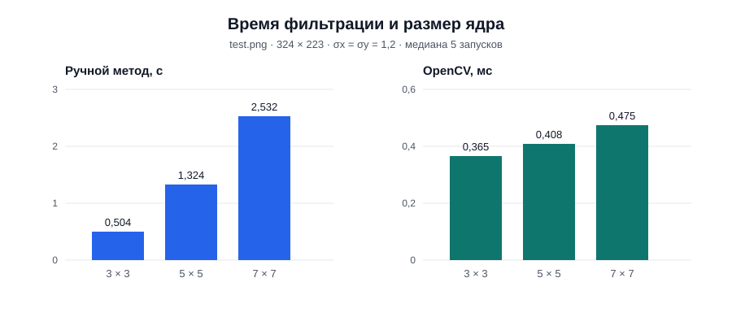
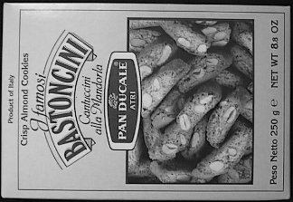

# Лабораторная работа № 1: фильтр Гаусса

**Вариант 3.** Усредняющий фильтр с весами, заданными функцией Гаусса. Размер ядра и параметры `sigma_x`, `sigma_y` вводятся пользователем. Цель работы — реализовать фильтрацию вручную, сравнить результат с OpenCV и измерить время выполнения.

## Теория

Фильтр заменяет значение пикселя взвешенным средним соседних пикселей. Вес зависит от расстояния до центра ядра: близкие пиксели обычно влияют сильнее. Для смещения `(x, y)` от центра ненормированный вес вычисляется так:

```text
G(x, y) = exp(−x² / (2σx²) − y² / (2σy²))
```

Затем каждый вес делится на сумму всех весов ядра:

```text
K(x, y) = G(x, y) / Σ G(i, j)
Iout(r, c) = Σ K(x, y) · Iin(r + y, c + x)
```

Сумма нормированных весов равна `1`, поэтому участок с постоянной яркостью сохраняет свою яркость. Сглаживание уменьшает мелкие детали и шум, одновременно смягчая границы объектов.

- **Размер ядра** — положительное нечётное число: `3`, `5`, `7` и т. д. Ядро квадратное, а нечётный размер позволяет выделить центральный элемент. Большее ядро охватывает больше соседей.
- **`sigma_x` и `sigma_y`** — стандартные отклонения по горизонтали и вертикали. Большая сигма делает веса внутри ядра более равномерными; при фиксированном размере это обычно усиливает размытие. Если сигмы различаются, размытие становится направленным.
- **Границы изображения** — координаты за пределами изображения заменяются координатами ближайшего граничного пикселя. Это соответствует `cv2.BORDER_REPLICATE`.

## Реализация

Код находится в [`main.py`](main.py). Программа читает изображение в оттенках серого, а параметры получает через `input()`.

1. `read_size`, `read_sigma_x`, `read_sigma_y` считывают и проверяют параметры.
2. `make_gaussian_kernel` вычисляет двумерное ядро по формуле и нормирует его.
3. `blur` вручную проходит по каждому пикселю, накладывает ядро и суммирует произведения яркостей на веса. За пределами изображения используется ближайший граничный пиксель.
4. `blur_opencv` вызывает `cv2.GaussianBlur` с тем же размером, сигмами и режимом обработки границ.
5. `main` запускает оба метода, сравнивает результаты до сохранения и записывает изображения.

Оба метода получают одно и то же изображение типа `float64`. Перед сохранением результаты округляются до целых значений яркости, ограничиваются диапазоном `[0, 255]` и преобразуются в `uint8`. Поэтому сравнение численных результатов и сравнение сохранённых PNG — разные проверки.

Ручной алгоритм выполняет порядка `H · W · K²` операций для изображения высоты `H`, ширины `W` и ядра `K × K`.

## Запуск

В PyCharm выберите интерпретатор `.venv\Scripts\python.exe` этого проекта. При необходимости установите зависимости в его терминале:

```powershell
.\.venv\Scripts\python.exe -m pip install numpy opencv-python
```

Запустите программу:

```powershell
.\.venv\Scripts\python.exe main.py
```

Пример ответов на запросы программы:

```text
Путь к изображению: test.png
Введите нечётный размер ядра: 7
Введите sigma_x: 1.2
Введите sigma_y: 1.2
```

Программа выводит пять измерений времени для каждого метода, их медианы и максимальную разницу между результатами. Итоговые файлы `result_manual.png` и `result_opencv.png` создаются в корне проекта и перезаписываются при следующем запуске. Изображения из экспериментов ниже сохранены отдельно в папке [`images/`](images/).

## Эксперимент

Использовано тестовое изображение [`test.png`](test.png): 324 × 223 пикселя, оттенки серого. Исходный пример взят из [набора тестовых изображений OpenCV](https://github.com/opencv/opencv/blob/4.x/samples/data/box.png). Среда измерений: Windows, Python 3.13.2, NumPy 2.5.3, OpenCV 4.14.0.

Для каждого набора параметров оба метода сначала запускались по одному разу без измерения времени. Затем выполнено по пять замеров каждого метода с помощью `time.perf_counter()`. Время загрузки изображения, построения ядра и сохранения PNG не включено. В таблице приведены медианы пяти замеров; скорость зависит от компьютера и текущей нагрузки.

| Ядро | `sigma_x` | `sigma_y` | Ручной метод, с | OpenCV, мс | Ускорение OpenCV |
| ---: | ---: | ---: | ---: | ---: | ---: |
| 3 × 3 | 1.2 | 1.2 | 0.5043 | 0.3651 | 1 381× |
| 5 × 5 | 1.2 | 1.2 | 1.3242 | 0.4083 | 3 243× |
| 7 × 7 | 1.2 | 1.2 | 2.5317 | 0.4746 | 5 334× |
| 7 × 7 | 0.8 | 0.8 | 2.5316 | 0.4519 | 5 602× |
| 7 × 7 | 2.0 | 2.0 | 2.5017 | 0.4757 | 5 259× |
| 7 × 7 | 2.0 | 0.8 | 2.6252 | 0.4738 | 5 541× |



Отдельный запуск из PyCharm, присланный для ядра **7 × 7** и сигм **1.2 / 1.2**, дал пять замеров ручного метода `2.5143, 2.4560, 2.4733, 2.4937, 2.5344 с` и OpenCV `0.000467, 0.000519, 0.000397, 0.000391, 0.000492 с`. Медианы — **2.4937 с** и **0.000467 с** соответственно. На экран была выведена максимальная разница `0.00000000`: это округление до восьми знаков после запятой. Результаты этого запуска сохранены как [`k7_sigma1.2_manual.png`](images/k7_sigma1.2_manual.png) и [`k7_sigma1.2_opencv.png`](images/k7_sigma1.2_opencv.png).

Во всех шести дополнительных проверках максимальная абсолютная разница между результатами *до округления* не превышала `2.3 × 10⁻¹³`. После преобразования в `uint8` изображения двух методов совпали по всем пикселям.

### Визуальное сравнение

Исходное изображение:



Размер ядра при одинаковых сигмах `1.2 / 1.2`:

| 3 × 3 | 5 × 5 | 7 × 7 |
| :---: | :---: | :---: |
|  |  |  |

Значение сигмы при ядре `7 × 7`:

| `0.8 / 0.8` | `1.2 / 1.2` | `2.0 / 2.0` | `2.0 / 0.8` |
| :---: | :---: | :---: | :---: |
|  |  |  |  |

## Выводы

- При одинаковых сигмах увеличение ядра с `3 × 3` до `7 × 7` увеличило время ручной обработки с `0.5043` до `2.5317` с. Это согласуется с обходом `K²` соседей для каждого пикселя. На примерах заметно более сильное сглаживание.
- При ядре `7 × 7` увеличение обеих сигм от `0.8` до `2.0` дало более выраженное размытие. Сигмы `2.0 / 0.8` показали, что сглаживание может различаться по горизонтали и вертикали.
- OpenCV обработал это изображение значительно быстрее ручного Python-кода. Числа характеризуют конкретные реализации, параметры и компьютер; другие условия могут дать иное соотношение времени.
- Численные результаты двух методов различаются только на уровне погрешности вычислений с плавающей точкой; сохранённые изображения совпадают по пикселям.

## Источники

- [Задание лабораторной работы](LW1.pdf).
- [OpenCV: `GaussianBlur` и фильтрация изображений](https://docs.opencv.org/4.x/d4/d86/group__imgproc__filter.html).
- [OpenCV: режимы обработки границ](https://docs.opencv.org/4.x/d2/de8/group__core__array.html).
- [OpenCV: исходное тестовое изображение `box.png`](https://github.com/opencv/opencv/blob/4.x/samples/data/box.png).
