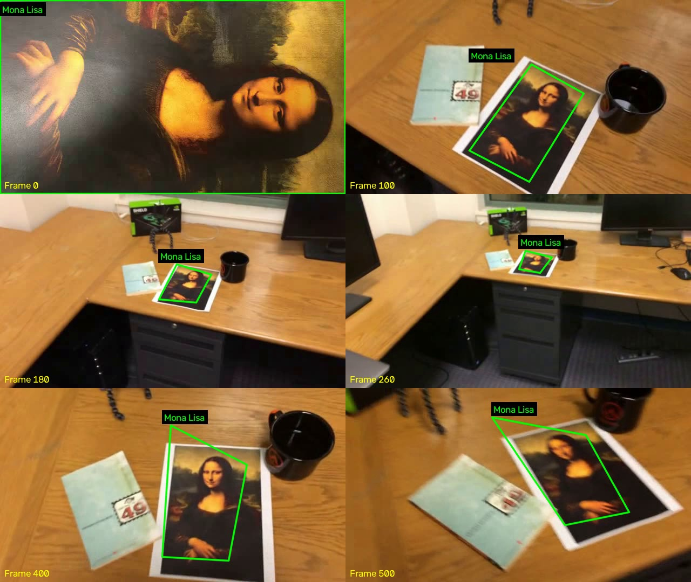
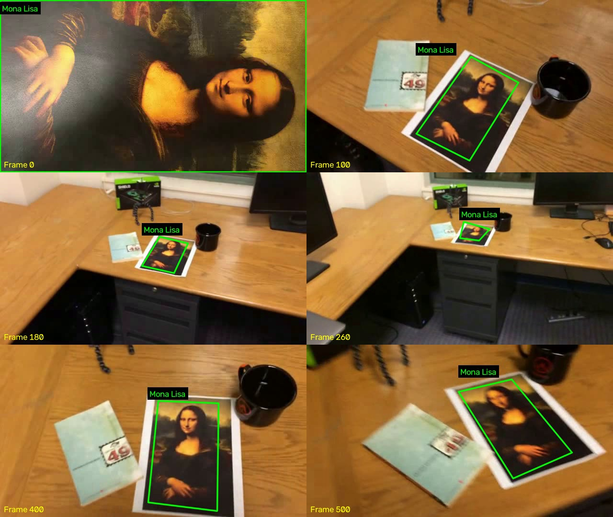

# Лабораторная работа №2. Трекинг плоского объекта на видео

Программа отслеживает текстурированный плоский объект по ключевым точкам, рисует его границы четырёхугольником с подписью и сохраняет обработанное видео. Эталон берётся из первого кадра. Реализация: Python, OpenCV и NumPy.

## 1. Теоретическая база

**SIFT** находит характерные точки изображения и вычисляет для каждой дескриптор из 128 чисел, описывающий изменения яркости в её окрестности. Масштаб и ориентация участка учитываются при формировании описания, что помогает сопоставлять объект после изменения размера и поворота.

**Сопоставление дескрипторов** выполняется через BFMatcher с расстоянием L2. Для каждой точки эталона выбираются два ближайших кандидата в текущем кадре. Совпадение сохраняется при `d1 < 0.75 * d2`: первый кандидат должен заметно превосходить второй. Порог 0.75 является настраиваемым параметром.

**Гомография** описывает проективное преобразование между двумя изображениями плоского объекта:

```text
s · [x', y', 1]ᵀ = H · [x, y, 1]ᵀ
```

Матрица `H` имеет размер 3 × 3. Преобразование применяется к четырём углам эталона, поэтому рамка учитывает перспективу. Для вычисления требуется не менее четырёх соответствий в невырожденном расположении. RANSAC отбрасывает совпадения, которые не согласуются с общей геометрией.

**Пирамидальный Lucas–Kanade** переносит уже найденные точки между соседними кадрами. Это позволяет продолжать сопровождение, когда на маленьком или размытом объекте недостаточно совпадений SIFT. Проверка переноса вперёд и обратно отбрасывает нестабильные точки. При уменьшении числа точек алгоритм Shi–Tomasi добавляет новые угловые точки внутри текущей рамки.

## 2. Описание разработанной системы

Алгоритм обработки:

1. Открыть видео и прочитать первый кадр.
2. Получить область объекта: выделить мышкой, передать координаты ROI или использовать весь первый кадр.
3. Сохранить изображение эталона, его углы, ключевые точки и дескрипторы SIFT.
4. На каждом кадре найти совпадения SIFT с эталоном и параллельно перенести сопровождаемые точки через Lucas–Kanade.
5. Оценить гомографию с RANSAC. При наличии непрерывного трекинга отбрасывать резкие скачки рамки SIFT. Использовать согласованное обнаружение SIFT либо сопровождение точек.
6. Обновить сопровождаемые точки; при необходимости добавить точки Shi–Tomasi. Их координаты пересчитываются в систему эталона через обратную гомографию.
7. Нарисовать рамку с подписью и записать кадр. При потере объекта пропустить рамку и продолжать поиск по исходному эталону.

Основные функции находятся в `main.py`:

| Функция | Назначение |
|---|---|
| `open_video` | Открытие видео и чтение первого кадра |
| `prepare_reference` | Выбор области объекта и подготовка эталона |
| `extract_features`, `match_features` | Поиск SIFT-признаков и сопоставление дескрипторов |
| `locate_object`, `transform_corners` | Вычисление гомографии и преобразование углов |
| `track_keypoints` | Сопровождение точек между соседними кадрами |
| `update_tracked_points`, `replenish_keypoints` | Обновление и пополнение набора точек |
| `draw_tracking` | Рисование границ и подписи |
| `process_video` | Цикл обработки, сохранение видео и статистики |
| `main` | Разбор аргументов командной строки |

Начальные параметры: до 2000 признаков SIFT, ratio 0.75, не менее 10 совпадений SIFT и 8 согласованных точек после RANSAC. Допустимая ошибка проекции: 5 пикселей для SIFT и 3 для сопровождения. Допустимая ошибка переноса точки вперёд и обратно: 1.5 пикселя. Для Lucas–Kanade используется окно 21 × 21 и пирамида с `maxLevel=3`. Набор пополняется, когда остаётся меньше 80 точек; для новых углов используется `qualityLevel=0.01` и `minDistance=3`.

Вырожденные, невыпуклые, чрезмерно большие рамки и рамки вне изображения отбрасываются. Результат сохраняется с исходным размером и FPS; первый кадр также включается в запись. Захват видео, запись и окна освобождаются в `finally`.

### Установка и запуск

Команды выполняются из папки проекта в активированном виртуальном окружении:

```powershell
python -m pip install -r requirements.txt
python main.py
```

По умолчанию откроется `test-videos/mona-lisa.avi`. Выделить объект мышкой и нажать Enter. Во время обработки Q или Esc завершают работу и сохраняют уже обработанную часть видео.

Для приложенных роликов эталон занимает первый кадр целиком:

```powershell
python main.py test-videos/mona-lisa.avi --full-frame --label "Mona Lisa"
```

Обработка без окон:

```powershell
python main.py test-videos/mona-lisa.avi --full-frame --no-display --label "Mona Lisa"
python main.py test-videos/mona-lisa-blur.avi --full-frame --no-display --label "Mona Lisa"
python main.py test-videos/mona-lisa-blur-extra-credit.avi --full-frame --no-display --label "Mona Lisa"
```

Заранее заданная область: `--roi X Y W H`, где X и Y — левый верхний угол, W и H — ширина и высота в пикселях. `--roi` и `--full-frame` взаимно исключаются. При `--no-display` один из этих способов выбора обязателен.

Своё видео можно обработать с ручным выбором объекта:

```powershell
python main.py "my-video.mp4" --label "Book" -o outputs/my-video_tracked.mp4
```

По умолчанию результат записывается в `outputs/<имя>_tracked.avi`, рядом создаётся JSON со статистикой. Подпись задаётся латиницей. AVI сохраняется с MJPG, MP4 — с mp4v. Совпадение входного и выходного пути запрещено. Итоговые видео не включаются в Git через `.gitignore`; кадры и JSON можно публиковать вместе с отчётом.

## 3. Результаты работы и тестирования системы

Используются три исходных ролика: `mona-lisa.avi`, `mona-lisa-blur.avi`, `mona-lisa-blur-extra-credit.avi`. Каждый содержит 558 кадров размером 640 × 360 с FPS 29.97. `simple_track.avi` содержит уже нарисованные рамки и служит визуальным образцом, поэтому не используется как исходное видео для оценки.

При первом прогоне базовый вариант SIFT + RANSAC дал рамку в 277, 258 и 250 кадрах соответственно ([статистика базового варианта](outputs/baseline_results.json)). Это выявило необходимость сопровождения и пополнения точек, когда объект становится маленьким.

Итоговый полный прогон с SIFT, Lucas–Kanade и пополнением точек:

| Видео | Обработано кадров | Кадров с рамкой | Доля кадров с рамкой | По SIFT / по сопровождению |
|---|---:|---:|---:|---:|
| `mona-lisa.avi` | 558 | 558 | 100.0% | 232 / 326 |
| `mona-lisa-blur.avi` | 558 | 539 | 96.6% | 118 / 421 |
| `mona-lisa-blur-extra-credit.avi` | 558 | 530 | 95.0% | 199 / 331 |

Подробная статистика этого прогона находится в [test_results.json](outputs/test_results.json); результаты отдельных запусков — в соответствующих файлах `outputs/*_tracked.json`.

Выбранные кадры результатов (0, 100, 180, 260, 400, 500):

Обычное видео:


Видео с размытием:



Усложнённое видео с размытием:



Число кадров с рамкой характеризует непрерывность работы алгоритма. Оно не является измерением точности границ: покадровой эталонной разметки углов нет. Границы дополнительно проверены визуально по выбранным кадрам результатов. В отдельных кадрах наблюдается смещение углов; рамка соответствует выбранной области эталона и не обязательно включает внешнюю белую кайму распечатки. На размытых вариантах осталось 19 и 28 кадров без надёжного результата, поэтому требование рамки во всех кадрах с видимым объектом нельзя считать безусловно выполненным для любых условий съёмки.

Примеры сильного размытия исходных кадров: [кадр 28 из mona-lisa-blur.avi](outputs/blur-example-1.jpg) и [кадр 399 из mona-lisa-blur-extra-credit.avi](outputs/blur-example-2.jpg). Нумерация начинается с нуля. На таких кадрах пропадают устойчивые детали рисунка, а перенос точек между соседними кадрами также может срываться.

### Автоматические проверки

```powershell
python -m unittest -v test_tracking
```

Проверяются восстановление известного проективного преобразования с ошибкой углов менее 3 пикселей, сохранение первого кадра, количества кадров, размера и FPS, отсутствие рамки на чёрном кадре, повторное обнаружение после пропажи объекта, обработка неверной ROI и отсутствующего файла, защита исходного видео от перезаписи и неизменность исходного кадра при рисовании. Семь проверок прошли. Дополнительно проверены запись MP4 и сообщения об ошибках при неверных аргументах командной строки.

Тестовое окружение: Windows, Python 3.15.0, OpenCV 5.0.0 (пакет `opencv-python` 5.0.0.93), NumPy 2.5.3. Автоматические прогоны выполнялись без окон; выбор мышкой проверяется при интерактивном запуске.

### Собственное видео

Собственная видеозапись пока не предоставлена и не протестирована. Синтетическое видео в автоматических проверках не заменяет этот пункт задания. Для записи подойдёт книга, открытка или распечатка с выраженным рисунком: в первом кадре показать объект целиком и крупно, затем менять расстояние и угол съёмки. После проверки необходимо добавить результаты и кадры в этот раздел.

## 4. Выводы по работе

Сопоставление с исходным эталоном позволяет обнаруживать объект повторно, а гомография даёт рамку с учётом перспективы. Сопровождение и пополнение точек необходимы для кадров, где объект слишком мал или размыт для устойчивого сопоставления SIFT. Надёжность зависит от текстуры, размера объекта, освещения и точности выбора эталона. При длительном сопровождении возможен дрейф; проверка по исходному эталону помогает его ограничивать. При недостатке надёжных точек рамка пропускается.

Сверка с заданием:

- [x] Реализована программа трекинга по ключевым точкам.
- [x] Реализованы рамка с подписью, перспективное преобразование и сохранение результата.
- [x] Выполнены прогоны трёх вариантов исходного видео.
- [x] Подготовлен README с теорией, описанием системы, тестированием, выводами и источниками.
- [ ] Достичь рамки во всех кадрах с видимым объектом на размытых роликах; текущие пропуски и смещения границ описаны выше.
- [ ] Записать и протестировать собственное видео, добавить результат в отчёт.
- [ ] Опубликовать код и README в репозитории GitHub; публикация пока не выполнена.

## 5. Использованные источники

1. [Задание лабораторной работы](LW2_25.pdf).
2. [OpenCV: Introduction to SIFT](https://docs.opencv.org/4.x/da/df5/tutorial_py_sift_intro.html).
3. [OpenCV: Feature Matching](https://docs.opencv.org/4.x/dc/dc3/tutorial_py_matcher.html).
4. [OpenCV: Feature Matching + Homography to find Objects](https://docs.opencv.org/4.x/d1/de0/tutorial_py_feature_homography.html).
5. [OpenCV: Optical Flow](https://docs.opencv.org/4.x/d4/dee/tutorial_optical_flow.html).
